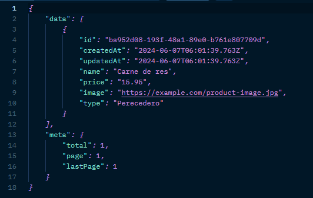
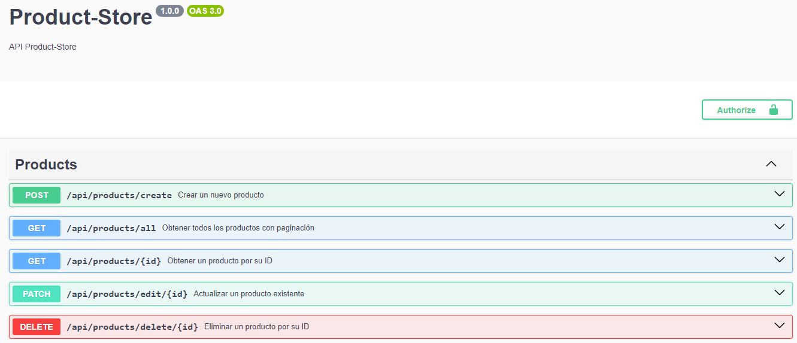
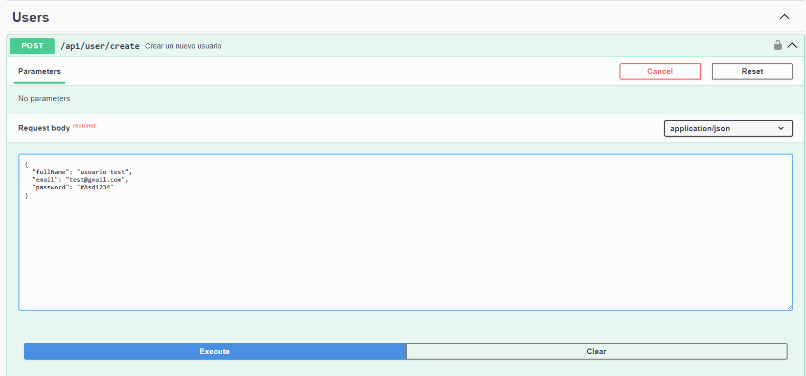
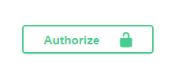
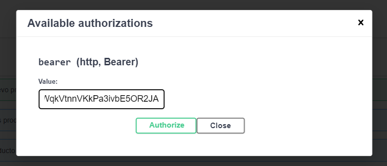

## Prueba BackEnd Developer Node Nest


## Instalación

```bash
$ npm install
```
## Deploy
https://server-store-sob3.onrender.com
## Agregar variables de entorno .env
    PORT=8080

    #DATABASE
    DB_HOST=localhost
    DB_PORT=5432
    DB_USERNAME=postgres
    DB_PASSWORD=1489
    DB_NAME=productdb

    #JWT
    HASH_SALT=10
    JWT_SECRET=mysecret
    JWT_EXPIRE=7d

## Endpoint
accede para tener todos los productos con paginacion y la metadata del paginado
https://server-store-sob3.onrender.com/api/product/all?page=1&limit=3




## Documentacion Swagger
### inicia el servidor en el puerto 8080
http://localhost:8080/api/docs
### o puedes acceder a través del enlace 
https://server-store-sob3.onrender.com/api/docs

para ingresar necesita registrarte 

Luego iniciamos sesion con el usuario creado

Copiamos el token y lo ingresamos\
\
autorizamos

y listo tenemos accesos a los endpoint 


## Excepciones
### Manejos de ``exepciones`` personalizadas
### Request CustomException
````
import { createCustomException } from 'src/common/exceptions/exceptionsGenerator';

if (userFound) {
      throw createCustomException(
        'El mensage para mostrar',
        409,
        'User',
      );
    }
````
### Response CustomException
````
{
    "timesstamps": "2024-04-21T18:43:38.308Z",
    "path": "/api/user",
    "error": {
        "message": "El mensage para mostrar",
        "error": "ERROR_USER_CONFLICTC",
        "statusCode": 409
    }
}
````
## Ejemplos de optimizacion de los endpoint
````
[POST]--> api/controller/create
[GET]--> api/controller/all
[GET]--> api/controller/:id
[UPDATE]--> api/controller/edit/:id
[PATCH]--> api/controller/edit/:id
[DELETE]--> api/controller/delete/:id
````
## Ejecutando la aplicación

```bash
# development
$ npm run start

# watch mode
$ npm run start:dev

# production mode
$ npm run start:prod
```

## Test

```bash
# unit tests
$ npm run test

# tests product-store
$ npm run test product-store.controller
$ npm run test product-store.service
$ npm run test create-product-store.dto

# test store
$ npm run test stores.controller
$ npm run test stores.service

#test product
$ npm run test product.controller
$ npm run test product.service
$ npm run test create-product.dto
$ npm run test pagination.dto
```


## Soporte
- Author - [David Flores](https://github.com/daelflodo)

